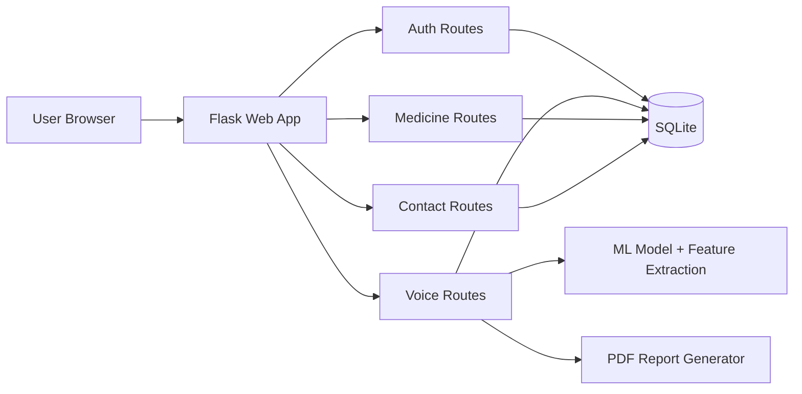

# NeuroGuard Architecture

## Stack
- Frontend: HTML/CSS/JS templates
- Backend: Flask + Blueprints
- Auth: JWT
- DB: SQLite via SQLAlchemy
- ML: librosa + scikit-learn model pipeline

## Components
- `routes/auth.py`: signup/login/OTP
- `routes/voice.py`: voice upload, analysis, report PDF
- `routes/medicine.py`: medicine registration + verification
- `routes/contact.py`: contact submit + admin list
- `models.py`: users, voice tests, medicine chain, contact messages

## Data Flow (Voice)
1. User uploads audio
2. Feature extraction + ML prediction
3. Stress/risk metrics calculated
4. Detailed report composed
5. Result saved to DB
6. PDF report generated on demand

## Security
- JWT protected APIs
- Security headers middleware
- Request payload size limits
- Rate limiting on auth-sensitive endpoints

## Diagram

